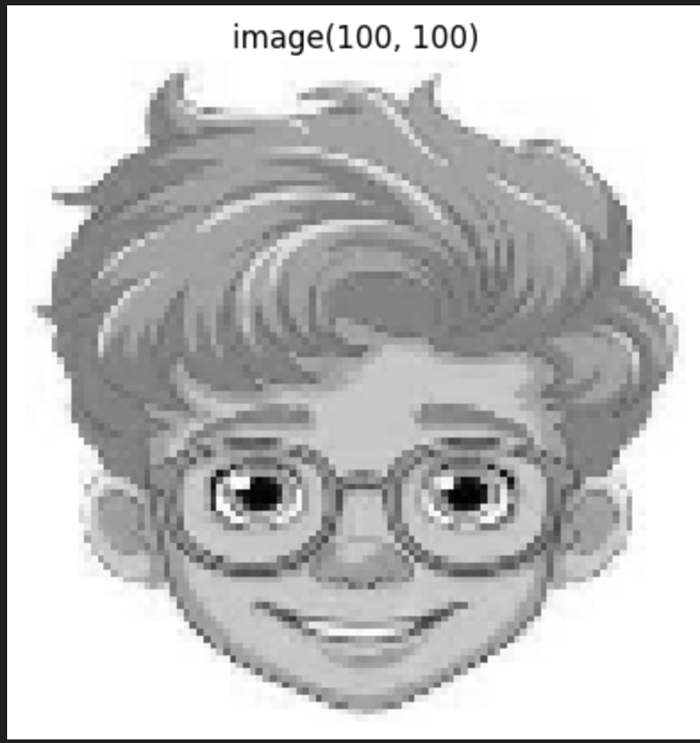

# Basic CNN Image Processing

This repository contains a Jupyter notebook that demonstrates basic image processing and custom convolution operations, a key component in Convolutional Neural Networks (CNNs). This project is ideal for beginners exploring the fundamentals of CNNs and how they process image data.

## 🌟 Features

- **📷 Image Loading & Preprocessing:** Learn how to load, resize, and convert images for further processing.
- **🧠 Custom Convolution Implementation:** Explore a step-by-step guide on implementing the convolution operation from scratch.
- **🔍 Image Visualization:** Visualize images before and after applying filters to understand how feature extraction works.

## 📂 Project Structure

```bash
.
├── Basic_CNN.ipynb        # Main notebook with code and explanations
└── README.md              # Project documentation
```

## 🚀 Getting Started

1. **Clone the repository:**

    ```bash
    git clone https://github.com/your-username/Basic-CNN-Image-Processing.git
    cd Basic-CNN-Image-Processing
    ```

2. **Install the required libraries:**

    The code relies on popular Python libraries like NumPy, OpenCV, and Matplotlib. Make sure they are installed:

    ```bash
    pip install numpy opencv-python matplotlib
    ```

3. **Run the notebook:**

    Open the Jupyter notebook to explore the code and visualize the output:

    ```bash
    jupyter notebook Basic_CNN.ipynb
    ```

## 📊 Example Output

Here’s an example of the input image and the result after applying custom convolution:

| Input Image | Grayscale Conversion
| :---------: | :------------------: | 
|  |  

## 💡 Concepts Covered

- Convolution operations in image processing
- Understanding how CNNs extract features
- Visualizing the effects of different filters

## 🛠️ Technologies Used

- **Python**
- **NumPy**
- **OpenCV**
- **Matplotlib**

## 🤝 Contributing

Contributions, issues, and feature requests are welcome! Feel free to check the [issues page](https://github.com/Vamsi404/Basic-CNN-Image-Processing/issues) for open topics.
